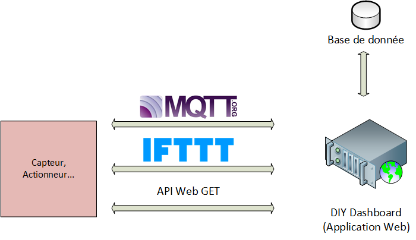

# DIY-Dashboard

Nuit de l'info 2018 : Défis - DIY-Dashboard

**Sujet :** De plus en plus de projets DIY se développent autour de la thématique de L’IoT (Internet of Things). Les objets connectés vont alors produire des données captées : environnement (température, qualité de l’air, …),  position dans l’espace, … , qui seront stockées dans des bases de données.

Ces données devront pouvoir être affichées sous la forme de tableaux de bord (Dashboard), sous différentes formes (valeurs numériques, jauges, courbes, …).

## Explication de l'idée

Nous somme partie sur l'idée d'une application web sur la quelle on peut ajouter de nouveaux capteurs, actionneurs qui peuvent communiquer avec plusieurs type de protocole. Cette application permettra de stocker les données dans une base de donnée et de les afficher dans un graphique pour chaque capteur.

Nous avons pas fini le projet mais il nous intéressent donc on pense le continuer après la nuit de l'info

## Schéma

## Aperçu de l'application web
   
