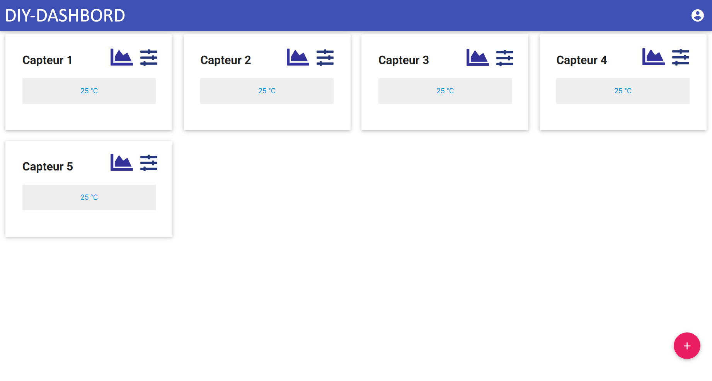
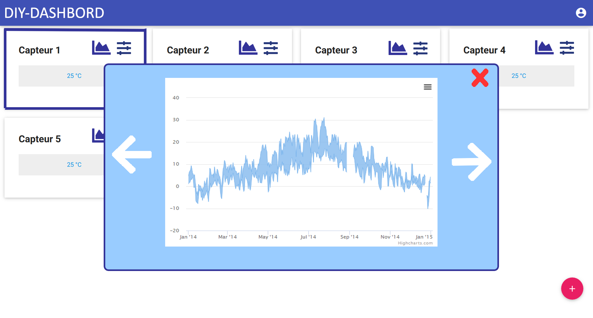

# DIY-Dashboard

Nuit de l'info 2018 : Défis - DIY-Dashboard

**Sujet :** De plus en plus de projets DIY se développent autour de la thématique de L’IoT (Internet of Things). Les objets connectés vont alors produire des données captées : environnement (température, qualité de l’air, …),  position dans l’espace, … , qui seront stockées dans des bases de données.

Ces données devront pouvoir être affichées sous la forme de tableaux de bord (Dashboard), sous différentes formes (valeurs numériques, jauges, courbes, …).

## Explication de l'idée

## Schéma

## Aperçu de l'application web
   
